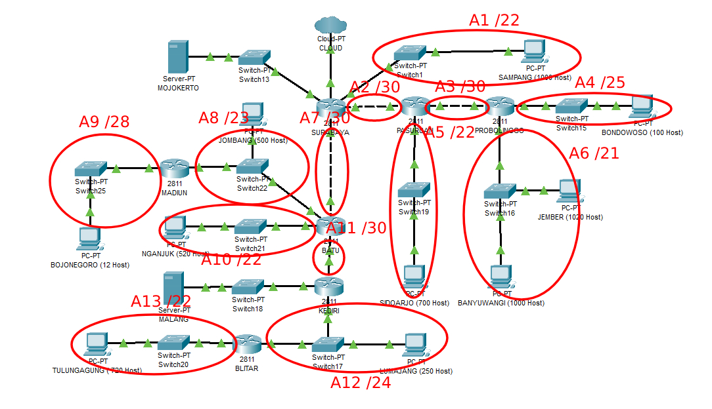
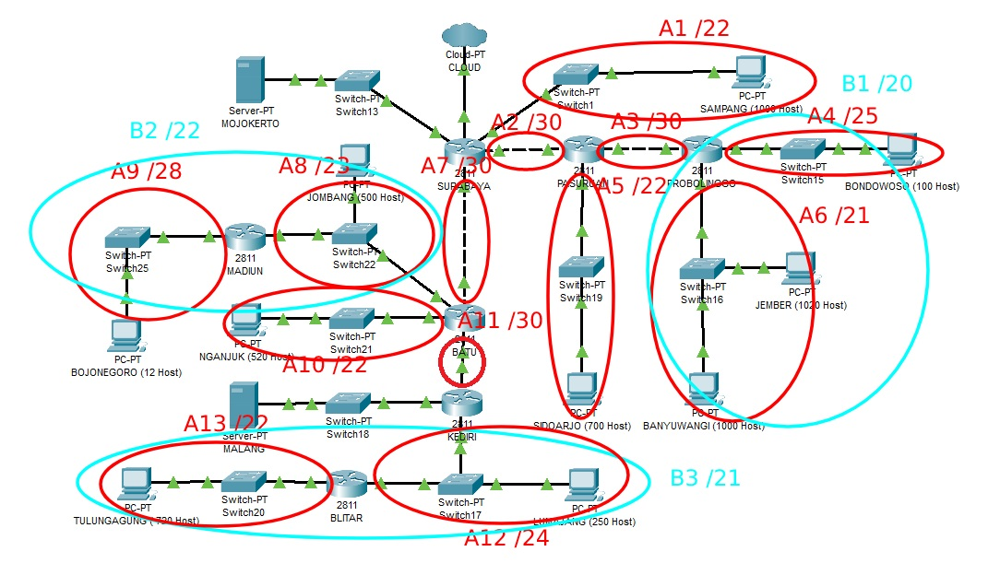
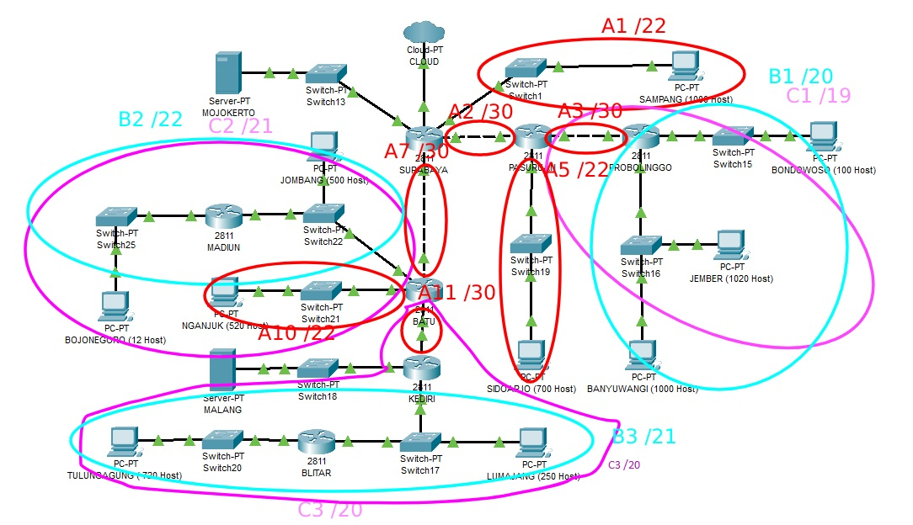
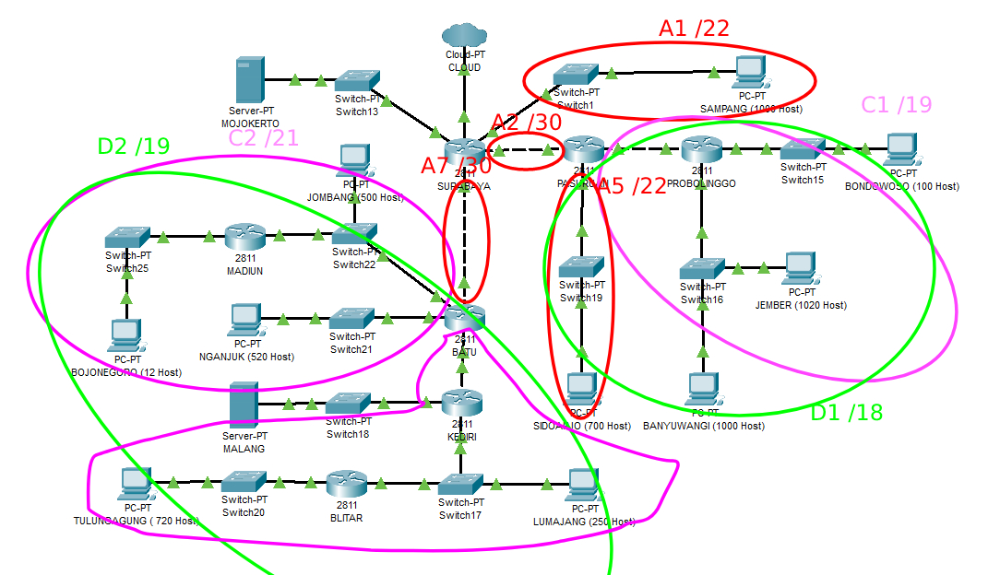
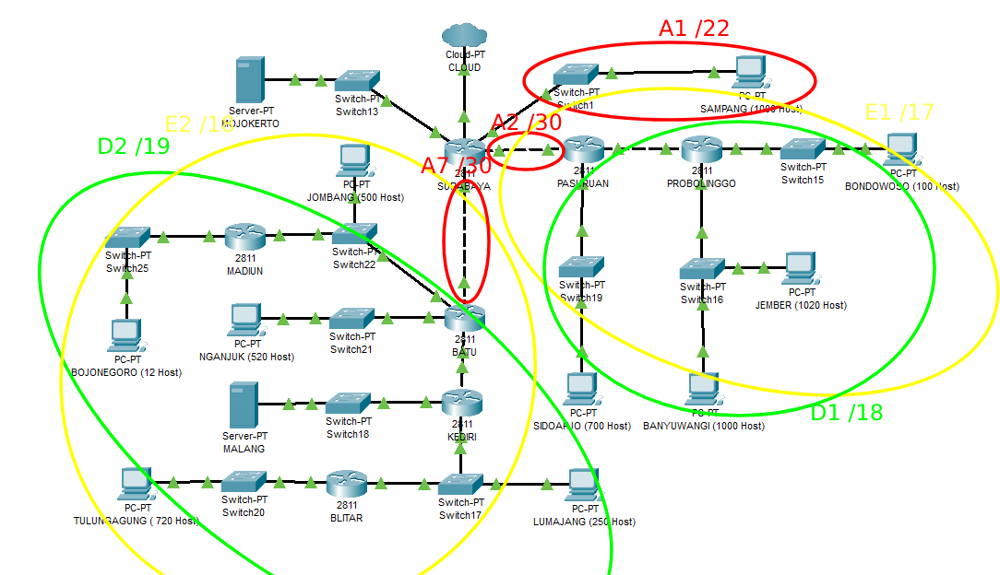
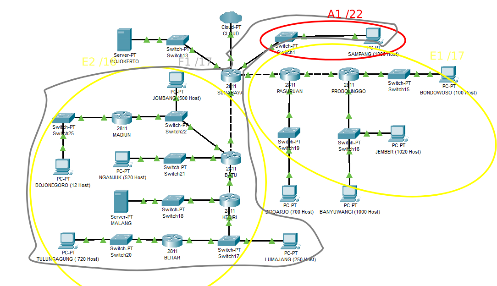
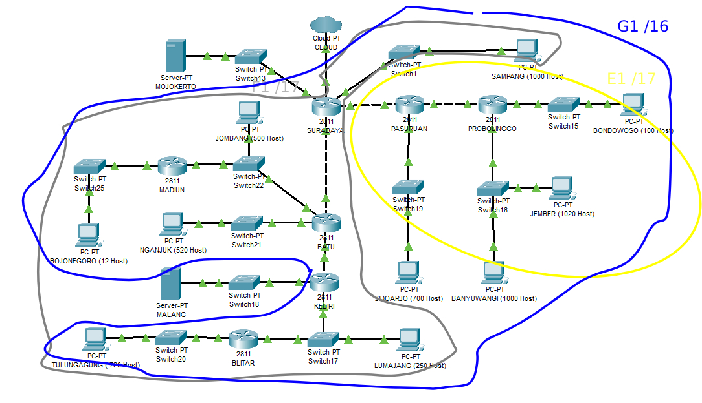
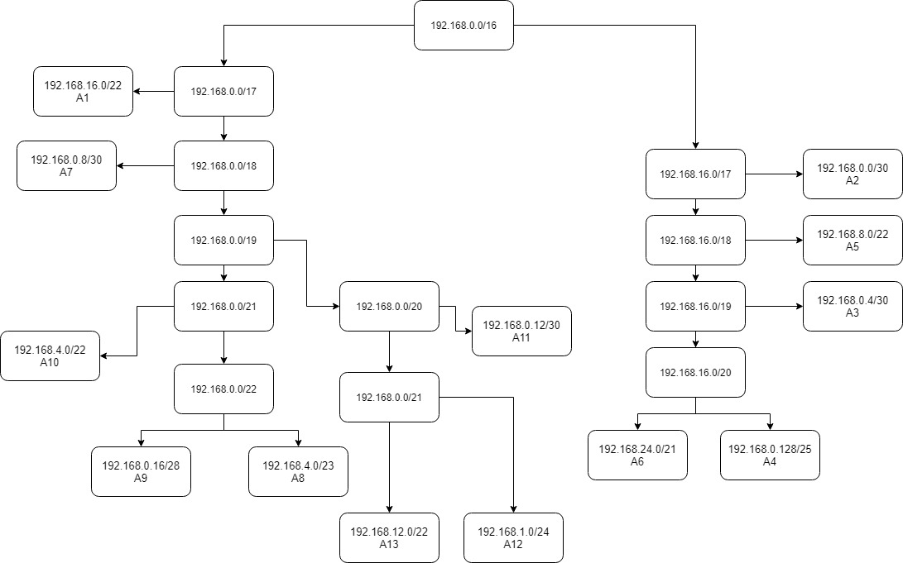

# Jarkom_Modul4_Praktikum_C14
## Kelompok C14
* M Ridho Daffa Ardista 05111840000065
* Rifki Aulia Irawan 05111840000142

# VLSM - CPT
* Pembagian Subnet :

* Tabel Perhitungan dan Pembagian IP  

* Pohon IP :


* Routing di CPT
  * Surabaya
```
192.168.8.0/22 via 192.168.0.2
192.168.0.128/25 via 192.168.0.2
192.168.24.0/21 via 192.168.0.2
192.168.2.0/23 via 192.168.0.10
192.168.12.0/22 via 192.168.0.10
192.168.0.16/28 via 192.168.0.10
192.168.0.12/30 via 192.168.0.10
192.168.16.0/22 via 192.168.0.10
192.168.1.0/24 via 192.168.0.10
10.151.77.76/30 via 192.168.0.10
192.168.0.4/30 via 192.168.0.2
```
  * Pasuruan
```
0.0.0.0/0 via 192.168.0.1
192.168.0.128/25 via 192.168.0.6
192.168.24.0/21 via 192.168.0.6
```
  * Probolinggo
```
0.0.0.0/0 via 192.168.0.5
```
  * Madiun
```
0.0.0.0/0 via 192.168.2.1
```
  * Batu
```
0.0.0.0/0 via 192.168.0.9
192.168.0.16/28 via 192.168.2.3
192.168.1.0/24 via 192.168.0.14
192.168.16.0/22 via 192.168.0.14
10.151.77.76/30 via 192.168.0.14
```
  * Kediri
```
0.0.0.0/0 via 192.168.0.13
192.168.16.0/22 via 192.168.1.3
```
  * Blitar
```
0.0.0.0/0 via 192.168.1.1
```
# CIDR - UML
* Pembagian Subnet :







* Tabel Perhitungan dan Pembagian IP :

* Pohon IP :


* Routing di UML
  * Topologi
```
# Switch
uml_switch -unix switch1 > /dev/null < /dev/null &
uml_switch -unix switch2 > /dev/null < /dev/null &
uml_switch -unix switch3 > /dev/null < /dev/null &
uml_switch -unix switch4 > /dev/null < /dev/null &
uml_switch -unix switch5 > /dev/null < /dev/null &
uml_switch -unix switch13 > /dev/null < /dev/null &
uml_switch -unix switch15 > /dev/null < /dev/null &
uml_switch -unix switch16 > /dev/null < /dev/null &
uml_switch -unix switch17 > /dev/null < /dev/null &
uml_switch -unix switch18 > /dev/null < /dev/null &
uml_switch -unix switch19 > /dev/null < /dev/null &
uml_switch -unix switch20 > /dev/null < /dev/null &
uml_switch -unix switch21 > /dev/null < /dev/null &
uml_switch -unix switch22 > /dev/null < /dev/null &
uml_switch -unix switch25 > /dev/null < /dev/null &

# Router
xterm -T SURABAYA -e linux ubd0=SURABAYA,jarkom umid=SURABAYA eth0=tuntap,,,10.151.76.61 eth1=daemon,,,switch1 eth2=daemon,,,switch2 eth3=daemon,,,switch4 eth4=daemon,,,switch13 mem=64M &
xterm -T PASURUAN -e linux ubd0=PASURUAN,jarkom umid=PASURUAN eth0=daemon,,,switch2 eth1=daemon,,,switch3 eth2=daemon,,,switch19 mem=64M &
xterm -T PROBOLINGGO -e linux ubd0=PROBOLINGGO,jarkom umid=PROBOLINGGO eth0=daemon,,,switch3 eth1=daemon,,,switch15 eth2=daemon,,,switch16 mem=64M &
xterm -T BATU -e linux ubd0=BATU,jarkom umid=BATU eth0=daemon,,,switch4 eth1=daemon,,,switch5 eth2=daemon,,,switch21 eth3=daemon,,,switch22 mem=64M &
xterm -T MADIUN -e linux ubd0=MADIUN,jarkom umid=MADIUN eth0=daemon,,,switch22 eth1=daemon,,,switch25 mem=64M &
xterm -T KEDIRI -e linux ubd0=KEDIRI,jarkom umid=KEDIRI eth0=daemon,,,switch5 eth1=daemon,,,switch17 eth2=daemon,,,switch18 mem=64M &
xterm -T BLITAR -e linux ubd0=BLITAR,jarkom umid=BLITAR eth0=daemon,,,switch17 eth1=daemon,,,switch20 mem=64M &

# Server
xterm -T MALANG -e linux ubd0=MALANG,jarkom umid=MALANG eth0=daemon,,,switch18 mem=64M &
xterm -T MOJOKERTO -e linux ubd0=MOJOKERTO,jarkom umid=MOJOKERTO eth0=daemon,,,switch13 mem=64M &

# Klien
xterm -T SAMPANG -e linux ubd0=SAMPANG,jarkom umid=SAMPANG eth0=daemon,,,switch1 mem=64M &
xterm -T SIDOARJO -e linux ubd0=SIDOARJO,jarkom umid=SIDOARJO eth0=daemon,,,switch19 mem=64M &
xterm -T BANYUWANGI -e linux ubd0=BANYUWANGI,jarkom umid=BANYUWANGI eth0=daemon,,,switch16 mem=64M &
xterm -T JEMBER -e linux ubd0=JEMBER,jarkom umid=JEMBER eth0=daemon,,,switch16 mem=64M &
xterm -T BONDOWOSO -e linux ubd0=BONDOWOSO,jarkom umid=BONDOWOSO eth0=daemon,,,switch15 mem=64M &
xterm -T BOJONEGORO -e linux ubd0=BOJONEGORO,jarkom umid=BOJONEGORO eth0=daemon,,,switch25 mem=64M &
xterm -T JOMBANG -e linux ubd0=JOMBANG,jarkom umid=JOMBANG eth0=daemon,,,switch22 mem=64M &
xterm -T NGANJUK -e linux ubd0=NGANJUK,jarkom umid=NGANJUK eth0=daemon,,,switch21 mem=64M &
xterm -T TULUNGAGUNG -e linux ubd0=TULUNGAGUNG,jarkom umid=TULUNGAGUNG eth0=daemon,,,switch20 mem=64M &
xterm -T LUMAJANG -e linux ubd0=LUMAJANG,jarkom umid=LUMAJANG eth0=daemon,,,switch17 mem=64M &
```
Setting Interface
*Router
  * SURABAYA
```
auto lo
iface lo inet loopback

auto eth0
iface eth0 inet static
address 10.151.76.62
netmask 255.255.255.252
gateway 10.151.76.61

auto eth1
iface eth1 inet static
address 192.168.4.1
netmask 255.255.252.0

auto eth2
iface eth2 inet static
address 192.168.0.1
netmask 255.255.255.252

auto eth3
iface eth3 inet static
address 192.168.0.9
netmask 255.255.255.252

auto eth4
iface eth4 inet static
address 10.151.77.121
netmask 255.255.255.252
```
  * PASURUAN
```
auto lo
iface lo inet loopback

auto eth0
iface eth0 inet static
address 192.168.0.2
netmask 255.255.255.252
gateway 192.168.0.1

auto eth1
iface eth1 inet static
address 192.168.0.5
netmask 255.255.255.252

auto eth2
iface eth2 inet static
address 192.168.8.1
netmask 255.255.252.0
```
  * PROBOLINGGO
```
auto lo
iface lo inet loopback

auto eth0
iface eth0 inet static
address 192.168.0.6
netmask 255.255.255.252
gateway 192.168.0.5

auto eth1
iface eth1 inet static
address 192.168.0.129
netmask 255.255.255.128

auto eth2
iface eth2 inet static
address 192.168.24.1
netmask 255.255.248.0
```
  * BATU
```
auto lo
iface lo inet loopback

auto eth0
iface eth0 inet static
address 192.168.0.10
netmask 255.255.255.252
gateway 192.168.0.9

auto eth1
iface eth1 inet static
address 192.168.0.13
netmask 255.255.255.252

auto eth2
iface eth2 inet static
address 192.168.12.1
netmask 255.255.252.0

auto eth3
iface eth3 inet static
address 192.168.2.1
netmask 255.255.254.0
```
  * KEDIRI
```
auto lo
iface lo inet loopback

auto eth0
iface eth0 inet static
address 192.168.0.14
netmask 255.255.255.252
gateway 192.168.0.13

auto eth1
iface eth1 inet static
address 192.168.1.1
netmask 255.255.255.0

auto eth2
iface eth2 inet static
address 10.151.77.125
netmask 255.255.255.252
```
  * MADIUN
```
auto lo
iface lo inet loopback

auto eth0
iface eth0 inet static
address 192.168.2.3
netmask 255.255.254.0
gateway 192.168.2.1

auto eth1
iface eth1 inet static
address 192.168.0.17
netmask 255.255.255.240
```
  * BLITAR
```
auto lo
iface lo inet loopback

auto eth0
iface eth0 inet static
address 192.168.1.3
netmask 255.255.255.0
gateway 192.168.1.1

auto eth1
iface eth1 inet static
address 192.168.16.1
netmask 255.255.252.0
```
* Server
  * MOJOKERTO
```
auto lo
iface lo inet loopback

auto eth0
iface eth0 inet static
address 10.151.77.122
netmask 255.255.255.252
gateway 10.151.77.121
```
  * MALANG
```
auto lo
iface lo inet loopback

auto eth0
iface eth0 inet static
address 10.151.77.126
netmask 255.255.255.252
gateway 10.151.77.125
```
* Client
  * SAMPANG
```
auto lo
iface lo inet loopback

auto eth0
iface eth0 inet static
address 192.168.4.2
netmask 255.255.252.0
gateway 192.168.4.1
```
  * SIDOARJO
```
auto lo
iface lo inet loopback

auto eth0
iface eth0 inet static
address 192.168.8.2
netmask 255.255.252.0
gateway 192.168.8.1
```
  * BANYUWANGI
```
auto lo
iface lo inet loopback

auto eth0
iface eth0 inet static
address 192.168.32.1
netmask 255.255.248.0
gateway 192.168.24.1
```
  * JEMBER
```
auto lo
iface lo inet loopback

auto eth0
iface eth0 inet static
address 192.168.28.1
netmask 255.255.248.0
gateway 192.168.24.1
```
  * BONDOWOSO
```
auto lo
iface lo inet loopback

auto eth0
iface eth0 inet static
address 192.168.0.130
netmask 255.255.255.128
gateway 192.168.0.129
```
  * JOMBANG
```
auto lo
iface lo inet loopback

auto eth0
iface eth0 inet static
address 192.168.2.2
netmask 255.255.254.0
gateway 192.168.2.1
```
  * BOJONEGORO
```
auto lo
iface lo inet loopback

auto eth0
iface eth0 inet static
address 192.168.0.18
netmask 255.255.255.240
gateway 192.168.0.17
```
  * NGANJUK
```
auto lo
iface lo inet loopback

auto eth0
iface eth0 inet static
address 192.168.12.2
netmask 255.255.252.0
gateway 192.168.12.1
```
  * LUMAJANG
```
auto lo
iface lo inet loopback

auto eth0
iface eth0 inet static
address 192.168.1.2
netmask 255.255.255.0
gateway 192.168.1.1
```
  * TULUNGAGUNG
```
auto lo
iface lo inet loopback

auto eth0
iface eth0 inet static
address 192.168.16.2
netmask 255.255.252.0
gateway 192.168.16.1
```
```iptables –t nat –A POSTROUTING –o eth0 –j MASQUERADE –s 192.168.0.0/16``` pada SURABAYA Agar UML dapat mengakses internet
Pada 4 router yaitu SURABAYA, PASURUAN, BATU, dan KEDIRI ditambahkan route baru (pada router lain tidak perlu, karena route 0.0.0.0/0 Secara otomatis di-setting pada UML).
Pada 4 router diatas ditambahkan route baru dan disimpan pada file route.sh ```nano route.sh```
  * SURABAYA
```
route add -net 192.168.128.0 netmask 255.255.128.0 gw 192.168.0.2
route add -net 192.168.0.0 netmask 255.255.192.0 gw 192.168.0.10
route add -net 192.168.64.0 netmask 255.255.252.0 gw 192.168.4.2
route add -net 10.151.77.120 netmask 255.255.255.252 gw 10.151.77.122
route add -net 10.151.77.124 netmask 255.255.255.252 gw 192.168.0.10
```
  * PASURUAN
```
route add -net 192.168.128.0 netmask 255.255.224.0 gw 192.168.0.6
route add -net 192.168.160.0 netmask 255.255.252.0 gw 192.168.8.2
```
  * BATU
```
route add -net 192.168.16.0 netmask 255.255.252.0 gw 192.168.2.2
route add -net 192.168.16.0 netmask 255.255.252.0 gw 192.168.2.3
route add -net 192.168.20.0 netmask 255.255.252.0 gw 192.168.12.2
route add -net 192.168.0.0 netmask 255.255.240.0 gw 192.168.0.14
route add -net 10.151.77.124 netmask 255.255.255.252 gw 192.168.0.14
```
  * KEDIRI
```
route add -net 10.151.77.124 netmask 255.255.255.252 gw 10.151.77.126
route add -net 192.168.0.0 netmask 255.255.248.0 gw 192.168.1.2
route add -net 192.168.0.0 netmask 255.255.248.0 gw 192.168.1.3
```
```source route.sh``` Untuk menjalankan route.sh
